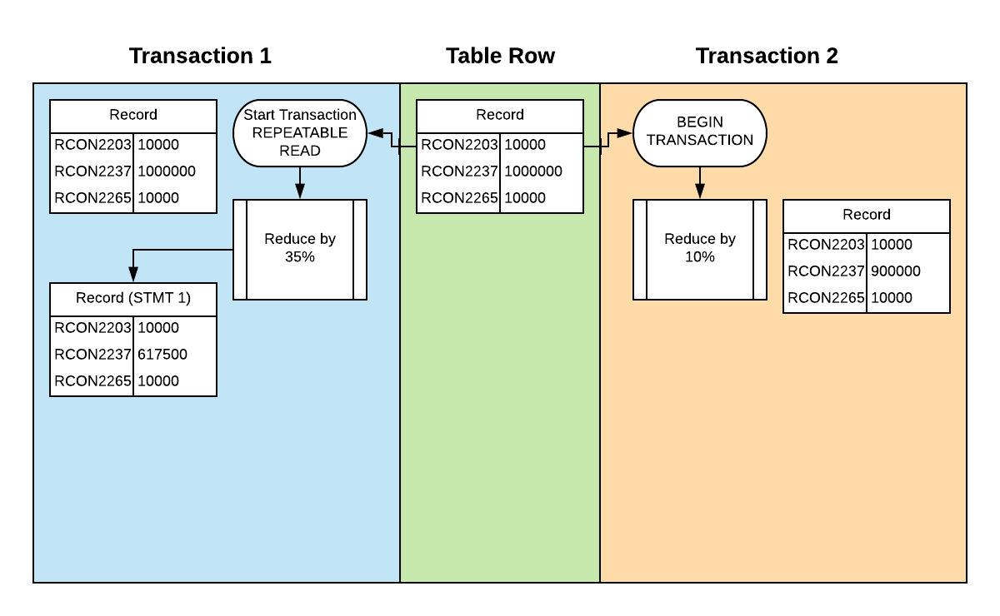
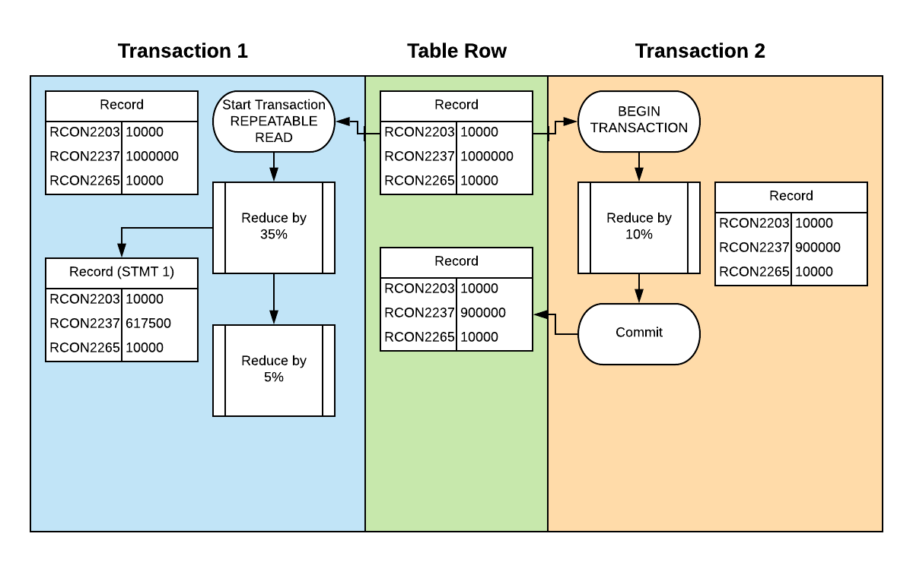
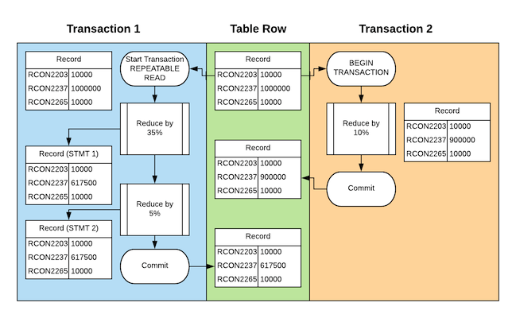
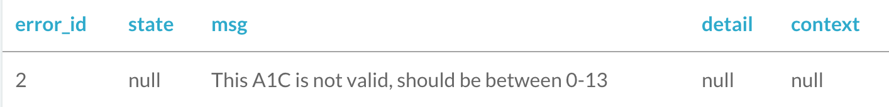
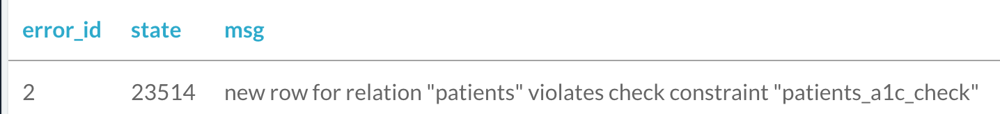
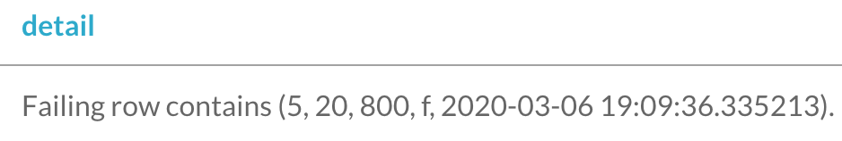
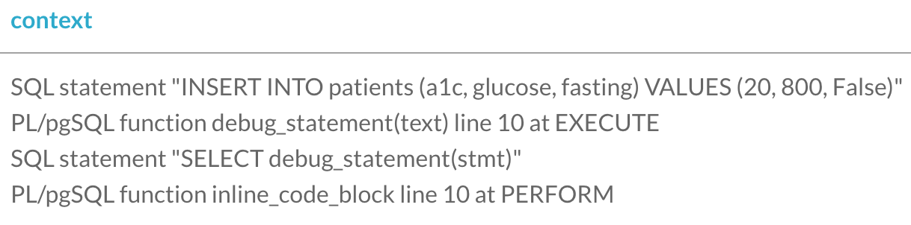

# How to Stop Worrying by using Transactions and Exceptions

---


---

# Postgres Transactions

* PostgreSQL _**REALLY**_ focuses on providing safety and sanity

---

# Two main places

* Statement Blocks
* Concurrent Scenarios

---

```sql
UPDATE cookies SET deliciousness = 11
WHERE name = 'Ginger Molasses';
```

^ This example is just an ordinary SQL statement. However, by default PostgreSQL treats every SQL statement as a transaction. 

---

```sql
BEGIN;

UPDATE cookies SET deliciousness = 11
WHERE name = 'Ginger Molasses';

COMMIT;
```

^ It wraps a BEGIN and a COMMIT around each one! Additionally, while we're working in SQL here, if you were using R or Python, many database libraries also automatically emit BEGIN and COMMIT statements around queries.

---

```sql
SELECT deliciousness FROM cookies
WHERE name = 'ANZAC';
```

^ Now, what about select queries? They also get wrapped. PostgreSQL tries to do everything it can to help provide safety and sanity to your queries. These are called single statement transactions.

---

# Statement Block breakdown

```sql
UPDATE cookies SET quantity = 2 
WHERE name = 'ANZAC';

INSERT INTO to_bake_list (name, quantity) 
VALUES ('ANZAC ', 12);
```

---

# Statement Block breakdown

```sql
UPDATE cookies SET quantity = 2 
WHERE name = 'ANZAC';
```
:boom:

```sql
INSERT INTO to_bake_list (name, quantity) 
VALUES ('ANZAC ', 12);
```

---

# wHy DoN't I jUsT dO tHiS 


# iN pYtHoN wItH tRy/CaTcH?

---

# Statement Block Transaction

```sql
BEGIN;

UPDATE cookies SET quantity = 2 
WHERE name = 'ANZAC';

INSERT INTO to_bake_list (name, quantity) 
VALUES ('ANZAC ', 12);

COMMIT;
```

---

# ~~Nested Transactions~~

---

# Savepoints

```sql
BEGIN;
    UPDATE cookies SET quantity = 2 
    WHERE name = 'ANZAC';

    INSERT INTO to_bake_list (name, quantity) 
    VALUES ('ANZAC ', 12);

    SAVEPOINT inventory_removal;

    INSERT INTO ingredients (name) VALUES ('flour');
    RELEASE SAVEPOINT inventory_removal;
COMMIT;
```

---

```sql
BEGIN;
    UPDATE cookies SET quantity = 2 
    WHERE name = 'ANZAC';

    INSERT INTO to_bake_list (name, quantity) 
    VALUES ('ANZAC ', 12);

    SAVEPOINT inventory_removal;

    INSERT INTO ingredients (name) VALUES ('flour');
    ROLLBACK TO SAVEPOINT inventory_removal;
COMMIT;
```

---


---

### dirty read
* A transaction reads data written by a concurrent uncommitted transaction.

### nonrepeatable read
* A transaction re-reads data it has previously read and finds that data has been modified by another transaction (that committed since the initial read).

---

### phantom read
* A transaction re-executes a query returning a set of rows that satisfy a search condition and finds that the set of rows satisfying the condition has changed due to another recently-committed transaction.

### serialization anomaly
* The result of successfully committing a group of transactions is inconsistent with all possible orderings of running those transactions one at a time.

---


---

| Isolation Level | Dirty Read | Nonrepeatable Read | Phantom Read |Serialization Anomaly|
| --- | --- | --- | --- | --- |
| Uncommitted  | :red_circle: | :white_check_mark: | :white_check_mark: | :white_check_mark: |
| Committed | :no_entry: | :white_check_mark: | :white_check_mark: | :white_check_mark: |
| Repeatable | :no_entry: | :no_entry: | :red_circle: | :white_check_mark: |
| Serializable | :no_entry: | :no_entry: | :no_entry: | :no_entry: |

---
[.code-highlight: none]
[.code-highlight: 1,15]
[.code-highlight: 2-6]
[.code-highlight: 8]
[.code-highlight: 10-14]
[.code-highlight: all]

```sql
START TRANSACTION ISOLATION LEVEL READ COMMITTED;
SELECT COUNT(*) FROM cookies WHERE name = 'lemon drop';
 count 
-------
      5
(1 row) 
         
-- Cookie 6 has been added in an external transaction.

SELECT COUNT(*) FROM cookies WHERE name = 'lemon drop';
 count 
-------
      6
(1 row) 
COMMIT;
```
---

## SERIALIZABLE

* Emulates serial transaction execution for all committed transactions.

## REPEATABLE READ

* Sees data committed before the transaction began
* Sees results of previous statements in the transaction
* Does not sees any changes committed by concurrent transactions.

^ Serializable treats the transactions as if transactions had been executed one after another, serially, rather than concurrently. This time, you are going to learn about the REPEATABLE READ isolation level. The Repeatable Read isolation level only sees data committed before the transaction began and the effects of previous updates executed within its transaction. To make that a bit clearer, if you have multiple statements in the same transaction, a statement lower in the transaction can see the results of the prior statements in that same transaction. It never sees any data committed or not from external transactions.

---
[.code-highlight: none]
[.code-highlight: 1,12]
[.code-highlight: 2-6]
[.code-highlight: 7-10]
[.code-highlight: all]
```sql
START TRANSACTION ISOLATION LEVEL REPEATABLE READ;

UPDATE ffiec_reci
SET RCON2237 = CAST(RCON2237 AS FLOAT) * .65
WHERE CAST(RCON2237 AS FLOAT) > 1000000;
SAVEPOINT first;

UPDATE ffiec_reci
SET RCON2237 = CAST(RCON2237 AS FLOAT) * .95
SAVEPOINT second;

COMMIT;
```

---



---



---



---
[.code-highlight: none]
[.code-highlight: 1,15]
[.code-highlight: 2-6]
[.code-highlight: 8]
[.code-highlight: 10-14]
[.code-highlight: all]
```sql
START TRANSACTION ISOLATION LEVEL SERIALIZABLE;
SELECT COUNT(*) FROM cookies WHERE name = 'lemon drop';
 count 
-------
      5
(1 row) 
         
-- Cookie 6 has been added in an external transaction.

SELECT COUNT(*) FROM cookies WHERE name = 'lemon drop';
 count 
-------
      5
(1 row) 
COMMIT;
```

---


---

# Detour

---

# Anonymous DO Funtions

---
[.code-highlight: none]
[.code-highlight: 1,6]
[.code-highlight: 2-3]
[.code-highlight: 4-5]
[.code-highlight: all]


```sql
DO $$
DECLARE
	--- Variables
BEGIN
    --- Statements
END; $$ language 'plpgsql';
```

---

# Exception Handling

---

# Exception Example

[.code-highlight: none]
[.code-highlight: 1,9]
[.code-highlight: 2-3]
[.code-highlight: 4-5]
[.code-highlight: 6-8]
[.code-highlight: all]

```sql
DO $$f
DECLARE
	v_msg TEXT;
BEGIN
     INSERT INTO patients (a1c, glucose, fasting) values (20, 800, False);
EXCEPTION WHEN check_violation THEN
    v_msg = 'This A1C is not valid, should be between 0-13';
    INSERT INTO errors (msg) VALUES (v_msg);
END; $$ language 'plpgsql';
```

---
[.build-lists: true]
# Graceful Fallback

* This is delightfully evil
* Think long and hard before you do this...
* I'm so not responsible for what you do with this...
* seriously...
* You can perform other data actions in the exception handling section!

---

# W... T... F...

---

# Gracefal Fallback Example

```sql
DO $$
DECLARE
	v_msg TEXT;
BEGIN
     INSERT INTO patients (a1c, glucose, fasting) values (20, 800, False);
EXCEPTION WHEN check_violation THEN
    v_msg = 'This A1C is not valid, should be between 0-13';
    INSERT INTO errors (msg) values (v_msg);
    INSERT INTO patients (a1c, glucose, fasting) values (13, 800, False);
     v_msg = 'Set A1C to the maximum of 13';
    INSERT INTO errors (msg) values (v_msg);
END; $$ language 'plpgsql';
```

---




---

# Stacked Diagnostics

---

|Name |Description|
| --- | --- |
|`RETURNED_SQLSTATE` | the SQLSTATE error code of the exception|
|`COLUMN_NAME` | the name of the column related to exception|
|`CONSTRAINT_NAME` | the name of the constraint related to exception|
|`PG_DATATYPE_NAME` | the name of the data type related to exception|
|`MESSAGE_TEXT` | the text of the exception's primary message|

---

|Name |Description|
| --- | --- |
|`TABLE_NAME` | the name of the table related to exception|
|`SCHEMA_NAME` | the name of the schema related to exception|
|`PG_EXCEPTION_DETAIL` | the text of the exception's detail message, if any|
|`PG_EXCEPTION_HINT` | the text of the exception's hint message, if any|
|`PG_EXCEPTION_CONTEXT` | line(s) of text describing the call stack at the time of the exception|
---

# Debug as a function

```sql
CREATE OR REPLACE FUNCTION debug_statement(
    sql_stmt TEXT
)
RETURNS BOOLEAN AS
$BODY$

    DECLARE
        v_state   TEXT;
        v_msg     TEXT;
        v_detail  TEXT;
        v_context TEXT;
    BEGIN
        BEGIN
            EXECUTE sql_stmt;
        EXCEPTION WHEN others THEN
            GET STACKED DIAGNOSTICS
                v_state   = RETURNED_SQLSTATE,
                v_msg     = MESSAGE_TEXT,
                v_detail  = PG_EXCEPTION_DETAIL,
                v_context = PG_EXCEPTION_CONTEXT;
            INSERT into errors (msg, state, detail, context) values (v_msg, v_state, v_detail, v_context);
            RETURN False;
        END;
        RETURN True;
    END;

$BODY$
LANGUAGE plpgsql;
```

---
[.code-highlight: 1-11]
```sql
CREATE OR REPLACE FUNCTION debug_statement(
    sql_stmt TEXT
)
RETURNS BOOLEAN AS
$BODY$

    DECLARE
        v_state   TEXT;
        v_msg     TEXT;
        v_detail  TEXT;
        v_context TEXT;
    BEGIN
```

---
[.code-highlight: 2-15]
```sql
        v_context TEXT;
    BEGIN
        BEGIN
            EXECUTE sql_stmt;
        EXCEPTION WHEN others THEN
            GET STACKED DIAGNOSTICS
                v_state   = RETURNED_SQLSTATE,
                v_msg     = MESSAGE_TEXT,
                v_detail  = PG_EXCEPTION_DETAIL,
                v_context = PG_EXCEPTION_CONTEXT;
            INSERT into errors (msg, state, detail, context) values (v_msg, v_state, v_detail, v_context);
            RETURN False;
        END;
        RETURN True;
    END;
$BODY$

```

---
[.code-highlight: 3-4]
```sql
        RETURN True;
    END;
$BODY$
LANGUAGE plpgsql;
```

---

# Debug example

```sql
DO $$
DECLARE
    stmt VARCHAR(100) := 'INSERT INTO patients (a1c, glucose, fasting)
                          VALUES (20, 800, False)';
BEGIN
     EXECUTE stmt;
EXCEPTION WHEN OTHERS THEN
    PERFORM debug_statement(stmt);
END; $$ language 'plpgsql';
```
---



---



---



---

# Thank you
